# Vibe Coding 实战记录

## 引言

&emsp;&emsp;Vibe Coding，即氛围编程或直觉编程，是一种通过自然语言与AI协作生成代码的新型编程方式，让开发者专注于产品设计而非逐行编码。从个人角度出发理解，其核心步骤可拆分为：

1. **需求分析** ：将需求转化为明确的功能点。
2. **任务拆解** ：将功能点拆分为独立、可执行的开发任务。
3. **执行要点编写** ：为每个任务编写详细的“执行要点”（包括核心实现逻辑、边界条件、验收标准）。
4. **AI 代码生成** ：将执行要点输入 AI 工具生成可运行的代码片段。
5. **集成与测试** ：将生成的代码集成到项目中，运行测试并修复问题。
6. **迭代优化** ：根据测试结果和新的需求，重复上述步骤。

&emsp;&emsp;本文以开发一个贪吃蛇游戏项目为例，从零开始，带大家体验Vibe Coding，希望能够给到大家一些关于与AI协作开发上的帮助和启发。

## 环境准备

**IDE**：VS Code
**AI编程工具**：Roo Code

- 从模式市场安装`User Story Creator`模式
    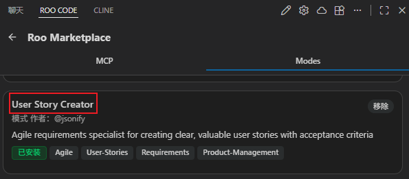
    &emsp;&emsp;`User Story Creator`模式能够将定义的模糊需求，转换为清晰且有价值的用户故事，并设定验收标准，方便后续基于需求执行较为精准的任务分解。

- 新建自定义模式：`Task Decomposition Assistant`

    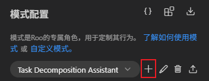
    &emsp;&emsp;`Task Decomposition Assistant`模式用于将需求需求拆解为结构化、可执行、可验收的任务单元，方便后续AI基于任务描述生成代码，所使用的提示词见附录。


**大模型**：DeepSeek-V3.2 (Thinking Mode)

## 拟定需求

&emsp;&emsp;拟定的初始需求如下：

```Markdown
# 贪吃蛇游戏

- 游戏窗口尺寸：800*800

- 启动游戏，首先呈现游戏开始交互页面(嵌入于主窗口)，具有黑色边框，尺寸为400*400

- 游戏开始交互页面需要居中显示游戏名称："Snake Game"

- 游戏开始交互页面下方有"Start"按钮

- 用户点击"Start"按钮后，游戏开始交互页面消失，展现游戏页面，开始倒计时3s

- 倒计时结束后，游戏页面上方出现一条向下移动的小蛇，小蛇初始长度为3节，每一节为20*20的带圆角蓝色方块

- 小蛇会自动移动，移动速度为20/s，具有上、下、左、右四个移动东西，用户可以通过键盘上的上、下、左、右按键控制切换，并且如果用户按下的方向控制按键与小蛇实际移动方向一致，那么会控制小蛇朝该方向主动移动20距离

- 每过5s，场景中会在随机位置生成一个水果(20*20的带圆角红色方块)，

- 小蛇在移动过程中，接触到水果，则长度会增加1节

- 若小蛇在移动过程中，蛇头触碰到自身或边界吗，则游戏结束，游戏窗口呈现游戏结束交互页面(嵌入于主窗口)，具有黑色边框，尺寸为400*400

- 游戏结束交互页面居中有"Restart"按钮,用户点击后，可重新开始游戏
```
&emsp;&emsp;将初始化需求作为输入，交给 AI 进行优化整理，输出基于用户故事模板的需求描述，此时需要人工进行需求审核，确保需求符合预期，具体内容见附录。
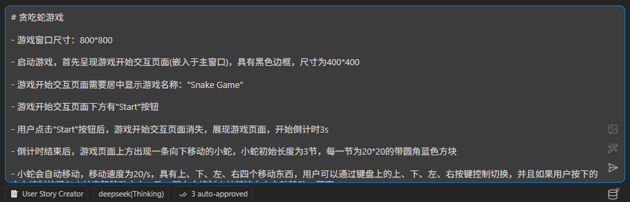

## 任务拆解

&emsp;&emsp;将最终确定的开发需求作为输入，交给 AI 进行任务分解，输出的任务根据主题分类，主题间互相独立或按顺序组织，每个主题再拆解出若干任务执行单元，任务输出具体内容见附录。

&emsp;&emsp;建议将任务根据主题分成多个文档，因为后续 AI Coding 环节是逐任务执行单元进行的，无需将全部任务描述作为输入，能够减少输入Token消耗。

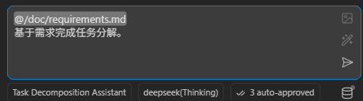

## 任务执行

&emsp;&emsp;任务执行一般有两种情况：首次执行和调整后重新执行(由于AI首次生成代码不符合预期，需要调整任务描述后重新执行)，提示词模板分别如下：

- 任务首次执行：

```Markdown
开始执行<任务-XXX>，要求：
- 严格按照任务执行要点和规范
- 绝对不许执行与当前任务执行要点无关的任务和工作内容
- 任务执行过程中若存在目标或实现不明确情况，及时反馈问题并寻求帮助
```

- 任务重新执行

```Markdown
<任务-XXX>执行要点发生变更，需要重新执行，要求：
- 严格按照任务执行要点和规范
- 绝对不许执行与当前任务执行要点无关的任务和工作内容
- 任务执行过程中若存在目标或实现不明确情况，及时反馈问题并寻求帮助
- 在原有任务执行基础上，针对补充或变更的执行要点，完成任务执行成果修改
```

**任务执行提示示例**：

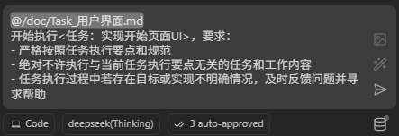

&emsp;&emsp;每执行一个任务单元，需要进行测试验证，若不符合任务验收标准，则需要调整或补充任务描述，重新执行，直至满足任务完成验收标准。任务完成后，需要及时将新增或改动源码提交仓库，可以利用AI自动生成 Commit 信息并提交，提示词模板如下：

- 源码改动情况 Commit 信息生成

```Markdown
通过<XXX>版本控制系统命令对比当前工作区<XXX>源文件修改情况，并结合分析<任务XXX>核心执行要点完成情况，生成Code Commit信息，输出格式要求：

<任务-XXX>
1、针对执行要点：XXX，修改:XXX，实现：XXX；
2、针对执行要点：XXX，修改:XXX，实现：XXX；

- 只关注选定源文件内容
- 只关注文件内容修改部分
- 只关心任务核心执行要点
```

- 源码新增情况 Commit 信息生成

```Markdown
根据当前工作区<>源文件实现情况，并结合分析<任务：XXX>核心执行要点完成情况，生成Code Commit信息，输出格式要求：

<任务-XXX>
1、针对执行要点：XXX，修改:XXX，实现：XXX；
2、针对执行要点：XXX，修改:XXX，实现：XXX；

- 只关注选定源文件内容
- 只关心任务核心执行要点
```

&emsp;&emsp;AI 完成 Commit 信息生成后，人工执行审核，无误后，再让 AI 执行 Commit。


**完整的任务执行及测试验收过程如下**：

- 游戏窗口与页面渲染-创建游戏主窗口

    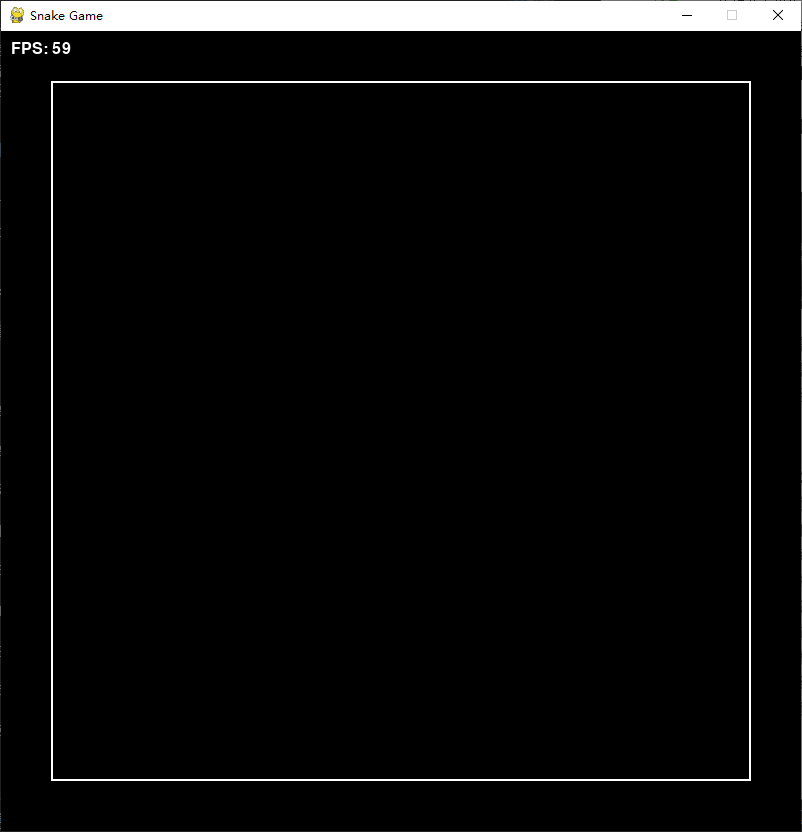{width=300}

- 用户界面-实现开始页面UI

    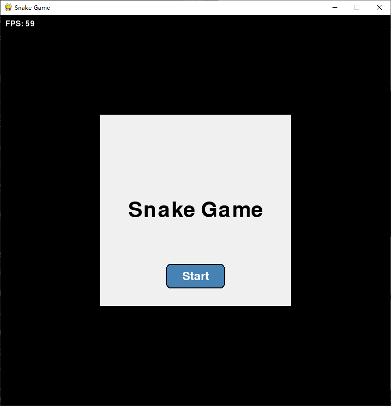{width=300}

- 游戏流程控制-实现开始游戏与倒计时逻辑

    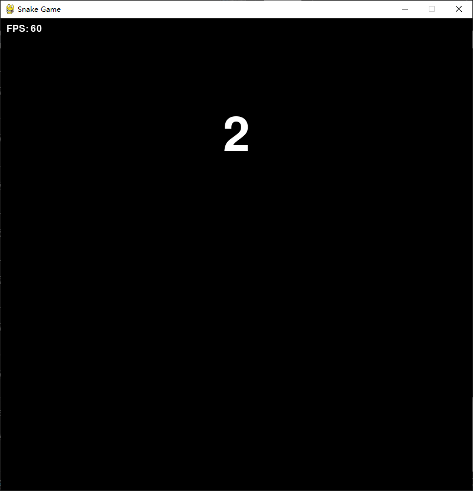{width=300}

- 小蛇-小蛇实体初始化

    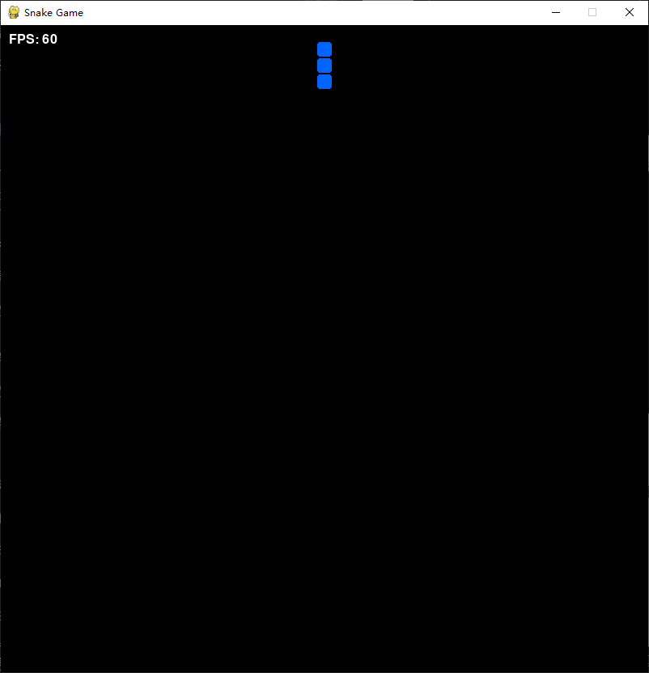{width=300}

- 小蛇-小蛇自动移动系统

    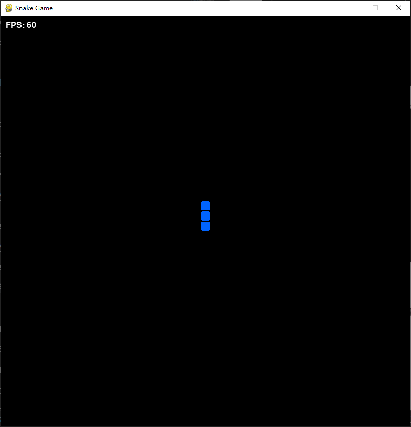{width=300}

- 小蛇-实现键盘方向控制

    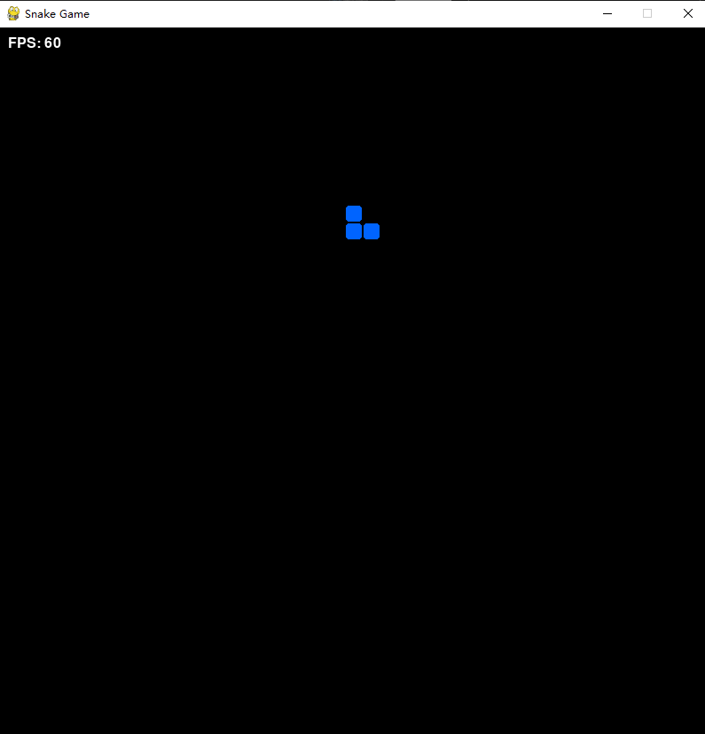{width=300}

- 水果-实现水果生成逻辑

    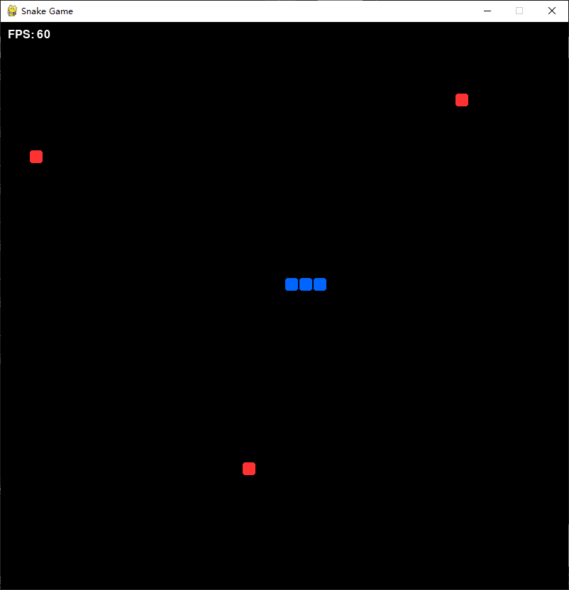{width=300}

- 游戏逻辑-实现碰撞检测与增长逻辑

    {width=300}

- 游戏逻辑-实现游戏结束检测

    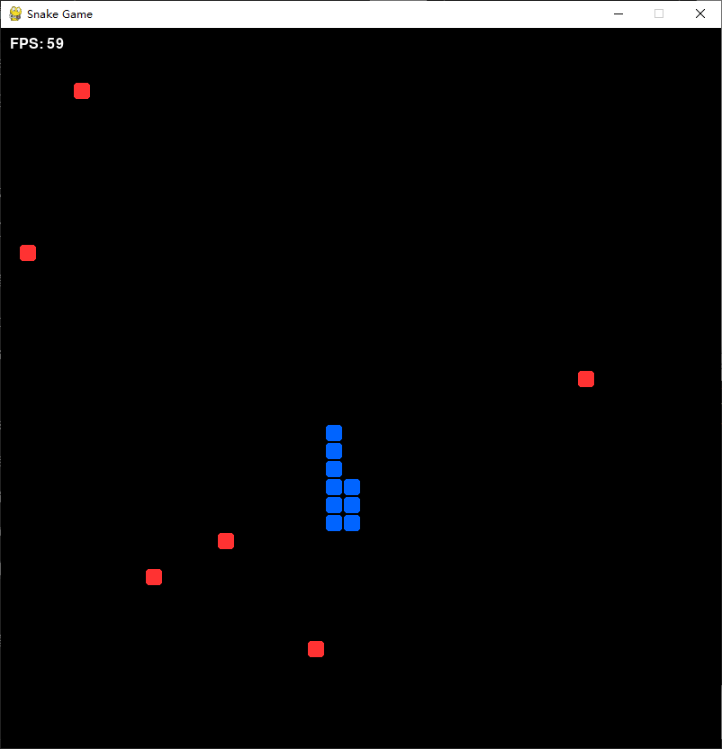{width=300}

- 用户界面-实现结束页面UI

    {width=300}


&emsp;&emsp;至此，整个项目开发完成。


## 总结

Vibe Coding 不是某种特定的技术框架，而是一种**关注开发者心理体验的工程实践**。通过任务拆解、文档驱动、小步提交，我们可以在享受编码乐趣的同时，高效产出高质量、可维护的代码。

基于贪吃蛇项目，提炼出以下 Vibe Coding 实战建议：

### ✅ 应该做的
- **拆解任务**：使用 `Task_` 前缀的 Markdown 文件记录每个任务，明确目标与验收标准。
- **提交即文档**：提交信息不仅要说明“改了哪里”，还要解释“为什么这样改”，便于日后维护与复盘。
- **保持小步快跑**：每个提交只做一个完整的子功能，确保随时可以回退且不影响其他部分。
- **先文档后代码**：在动手写代码之前，先花 5–10 分钟写下任务要点与验收标准，这能大幅提升编码时的专注度。
- **定期回顾**：可视化自己的进展，获得成就感。

### ❌ 应该避免的
- **大而全的提交**：一次性提交数百行代码，难以回顾且容易引入隐藏 bug。
- **模糊的任务描述**：如“优化代码”“修复 bug”这类描述无法提供明确的目标感。
- **忽略边界情况**：只实现“快乐路径”，等到测试时才暴露问题，打断心流。
- **长时间不提交**：连续编码数小时而不提交，容易导致疲劳且失去里程碑感。

## 附录

### 需求

```MarkDown

# 贪吃蛇游戏用户故事

---

## 1. 游戏窗口设置

**标题**：设置游戏主窗口尺寸

**作为** 一名玩家，
**我想要** 游戏窗口尺寸固定为800像素宽、800像素高，
**以便** 我有足够且一致的游戏区域进行游戏。

**验收标准**：
1. 游戏启动后主窗口尺寸为800×800像素。
2. 窗口不可调整大小（或调整大小不影响游戏区域）。
3. 窗口标题显示“Snake Game”。

**边界情况**：
- 在不同屏幕分辨率下窗口应居中显示。
- 窗口边框不影响内部游戏区域尺寸。

---

## 2. 开始交互页面

**标题**：显示游戏开始页面

**作为** 一名玩家，
**我想要** 游戏启动后首先看到一个居中的开始交互页面，
**以便** 我知道如何开始游戏并了解游戏名称。

**验收标准**：
1. 开始页面尺寸为400×400像素，带有黑色边框，居中显示在主窗口内。
2. 页面中央显示“Snake Game”标题（字体清晰可见）。
3. 页面下方有一个“Start”按钮。
4. 点击“Start”按钮后，开始页面消失。

**边界情况**：
- 标题和按钮在页面缩放或不同DPI下仍保持居中。
- 按钮有悬停和点击反馈。

---

## 3. 开始游戏流程

**标题**：点击开始后进入游戏并显示倒计时

**作为** 一名玩家，
**我想要** 点击“Start”按钮后看到游戏页面并有一个3秒倒计时，
**以便** 游戏不会立即开始，给我准备时间。

**验收标准**：
1. 开始页面消失后，游戏页面立即显示（同一窗口内）。
2. 游戏页面顶部显示“3、2、1”的倒计时数字，每秒更新一次。
3. 倒计时期间小蛇尚未出现。
4. 倒计时结束后，小蛇出现在游戏页面上方并开始向下移动。

**边界情况**：
- 倒计时期间用户按方向键不应影响游戏。
- 倒计时结束后小蛇立即开始移动，无延迟。

---

## 4. 小蛇初始状态与移动

**标题**：初始化小蛇并实现自动移动

**作为** 一名玩家，
**我想要** 小蛇初始长度为3节，每节为20×20像素的蓝色圆角方块，并自动以每秒20像素的速度移动，
**以便** 游戏有基本的移动机制。

**验收标准**：
1. 小蛇初始位置在游戏区域上方（例如Y=0附近）。
2. 小蛇初始方向为向下。
3. 小蛇每节之间无间隙，视觉上连续。
4. 小蛇以恒定速度（20像素/秒）平滑移动，不受帧率影响。
5. 小蛇移动时，身体各节跟随头部路径。

**边界情况**：
- 小蛇移动到边界前应能正常转向。
- 小蛇移动速度在低帧率下仍保持恒定（使用时间增量）。

---

## 5. 方向控制

**标题**：使用键盘方向键控制小蛇移动方向

**作为** 一名玩家，
**我想要** 通过按下键盘的上、下、左、右键改变小蛇的移动方向，
**以便** 我能引导小蛇去吃水果。

**验收标准**：
1. 按下上键时，若小蛇当前方向不是向下，则改为向上移动。
2. 按下下键时，若小蛇当前方向不是向上，则改为向下移动。
3. 按下左键时，若小蛇当前方向不是向右，则改为向左移动。
4. 按下右键时，若小蛇当前方向不是向左，则改为向右移动。
5. 如果按下的方向与当前方向相同，小蛇沿该方向额外移动20像素（即加速一次）。
6. 按键响应延迟低于100毫秒。

**边界情况**：
- 不允许180度立即掉头（例如向上时按向下无效）。
- 按键事件不会因为键位冲突而被忽略。

---

## 6. 水果生成

**标题**：定期在随机位置生成水果

**作为** 一名玩家，
**我想要** 每5秒在游戏区域内随机位置出现一个水果，
**以便** 我有目标去引导小蛇。

**验收标准**：
1. 水果为20×20像素的红色圆角方块。
2. 水果生成位置随机(方块左上角坐标为20的整数倍)，但必须在游戏区域内（坐标范围0~780）。
3. 水果不会与小蛇身体任何一节重叠。
4. 水果生成后保持静止，直到被小蛇吃掉或新水果生成。
5. 每5秒生成一个新水果，即使旧水果仍在场上（可同时存在多个水果）。

**边界情况**：
- 如果随机位置全部被占，应尝试有限次数后生成在可用位置。
- 水果生成时间间隔应准确（误差±0.1秒）。

---

## 7. 吃水果与增长

**标题**：小蛇头部碰到水果后长度增加

**作为** 一名玩家，
**我想要** 当小蛇头部与水果碰撞时，小蛇长度增加一节，水果消失，
**以便** 我的得分增加，游戏难度逐渐上升。

**验收标准**：
1. 碰撞检测基于小蛇头部与水果的边界框（矩形重叠）。
2. 碰撞发生后，水果立即从屏幕上消失。
3. 小蛇尾部增加一节（颜色、尺寸与现有节相同）。
4. 小蛇总长度增加后，移动速度保持不变（仍为20像素/秒）。
5. 游戏内没有视觉上的闪烁或延迟。

**边界情况**：
- 如果碰撞发生在两帧之间，仍应正确检测。
- 新增的一节在下一帧移动时跟随身体。

---

## 8. 游戏结束条件

**标题**：小蛇碰撞自身或边界时游戏结束

**作为** 一名玩家，
**我想要** 当小蛇头部碰到游戏区域边界或自己的身体时，游戏立即结束，
**以便** 游戏有明确的失败条件。

**验收标准**：
1. 小蛇头部触及游戏区域四边（X<0, X>=800, Y<0, Y>=800）时触发游戏结束。
2. 小蛇头部与自身任何一节（除头部外）重叠时触发游戏结束。
3. 游戏结束时，小蛇停止移动，所有输入被忽略。
4. 游戏结束交互页面立即显示。

**边界情况**：
- 碰撞检测应考虑小蛇头部的精确位置（20×20像素）。
- 如果小蛇在移动中同时碰到边界和自身，任一种情况都应触发结束。

---

## 9. 游戏结束交互页面

**标题**：显示游戏结束页面并提供重新开始选项

**作为** 一名玩家，
**我想要** 游戏结束后看到一个居中的结束页面，其中有“Restart”按钮，
**以便** 我可以重新开始游戏而不必重启应用。

**验收标准**：
1. 结束页面尺寸为400×400像素，带有黑色边框，居中显示。
2. 页面中央显示“Game Over”文字。
3. 页面下方有一个“Restart”按钮。
4. 点击“Restart”按钮后，结束页面消失，游戏重置到初始状态（包括开始页面）。
5. 重置后小蛇长度、位置、水果等全部恢复初始值。

**边界情况**：
- 结束页面显示期间，背景游戏画面应被遮盖（例如半透明遮罩）。
- 点击“Restart”后，游戏应无残留状态。

---

## 10. 非功能性需求

**标题**：确保游戏性能与用户体验

**作为** 一名玩家，
**我想要** 游戏运行流畅、响应迅速、无明显的卡顿或延迟，
**以便** 我能沉浸其中并获得愉快的游戏体验。

**验收标准**：
1. 游戏帧率不低于60 FPS（在标准硬件上）。
2. 键盘输入响应时间低于100毫秒。
3. 游戏窗口在失去焦点时暂停，重新获得焦点时继续。
4. 游戏资源（图像、声音）加载时间不超过2秒。
5. 游戏在不同分辨率、DPI设置下视觉元素保持比例。

**边界情况**：
- 长时间运行后内存使用量稳定，无内存泄漏。
- 游戏窗口最小化/还原后状态恢复正确。
 
```

### 任务

#### 游戏窗口与页面渲染

```MarkDown

## 任务主题：游戏窗口与页面渲染

### 任务：创建游戏主窗口

**目标：** 设置固定尺寸（800×800像素）的游戏主窗口，提供一致的游戏区域。

**核心执行要点：**
- 基于pygame组件实现
- 初始化窗口（宽800px，高800px），标题设置为“Snake Game”。
- 禁止窗口调整大小（或确保调整不影响游戏区域）。
- 实现窗口在不同屏幕分辨率下居中显示。

**非核心执行要点：**
- 处理高DPI缩放，确保视觉元素比例正确。
- 主程序文件名称为game.py

**验收标准：**
- 游戏启动后窗口尺寸精确为800×800像素。
- 窗口标题正确显示为“Snake Game”。
- 窗口无法被用户拖拽调整大小（或调整后游戏区域保持800×800）。
- 窗口在主流分辨率下居中显示。

**依赖：** 无（基础任务，可最先实施）。
```

#### 用户界面

```MarkDown
## 任务主题：用户界面

### 任务：实现开始页面UI

**目标：** 在游戏主窗口内显示居中的开始交互页面，包含标题与开始按钮。

**核心执行要点：**
- 实现为独立模块，位于独立py文件中
- 绘制400×400像素、带有黑色边框的矩形，居中于主窗口。
- 在矩形中央显示“Snake Game”标题（字体清晰、大小适中）。
- 在矩形内部下方添加“Start”按钮，支持点击事件。
- 点击按钮后，开始页面消失。

**非核心执行要点：**
- 为按钮添加悬停（hover）与点击（active）视觉反馈。
- 确保标题与按钮在不同DPI下仍保持居中。

**验收标准：**
- 开始页面尺寸、位置、边框符合设计。
- 标题与按钮文字清晰可见。
- 点击“Start”按钮后，页面正确隐藏（或移除）。
- 按钮交互反馈即时。

**依赖：** 游戏主窗口已创建。

---

### 任务：实现结束页面UI

**目标：** 游戏结束后显示居中的结束页面，提供重新开始选项。

**核心执行要点：**
- 实现为独立模块，位于独立py文件中
- 绘制400×400像素、带有黑色边框的矩形，居中于主窗口。
- 在矩形中央显示“Game Over”文字。
- 在矩形下方添加“Restart”按钮，支持点击事件。
- 点击按钮后，结束页面消失，游戏状态重置并重新开始游戏

**非核心执行要点：**
- 在结束页面显示时，添加半透明遮罩覆盖游戏画面。
- 确保重置后无残留状态（小蛇、水果等全部恢复初始值）。

**验收标准：**
- 结束页面尺寸、位置、边框符合设计。
- “Game Over”文字与“Restart”按钮清晰可见。
- 点击“Restart”按钮后，页面消失，游戏重新开始。
- 重置后小蛇长度、位置、水果等均恢复初始值。

**依赖：** 游戏结束条件检测已实现。

---
```

#### 游戏流程控制

```MarkDown
## 任务主题：游戏流程控制

### 任务：实现开始游戏与倒计时逻辑

**目标：** 点击开始按钮后隐藏开始页面，显示3秒倒计时，倒计时结束后初始化小蛇并开始游戏。

**核心执行要点：**
- 隐藏开始页面，显示游戏页面（同一窗口内）。
- 在游戏页面顶部显示“3、2、1”倒计时数字，每秒更新一次。
- 倒计时期间小蛇尚未出现，且键盘输入被忽略。
- 倒计时结束后，立即初始化小蛇并使其开始移动。

**非核心执行要点：**
- 倒计时数字使用醒目字体与动画效果。
- 倒计时结束后无缝过渡到游戏状态。

**验收标准：**
- 倒计时数字正确显示并按时更新（3→2→1）。
- 倒计时期间小蛇未出现，键盘输入无效。
- 倒计时结束瞬间小蛇出现在游戏区域上方并开始向下移动。
- 倒计时结束后键盘控制立即生效。

**依赖：** 开始页面UI、小蛇实体初始化。
```

#### 小蛇

```MarkDown
## 任务主题：小蛇

### 任务：小蛇实体初始化

**目标：** 创建长度为3节的小蛇，每节为20×20像素的蓝色圆角方块，初始位置在游戏区域上方，方向向下。

**核心执行要点：**
- 实现为独立模块，位于独立py文件中
- 定义小蛇数据结构（如数组存储每节坐标）。
- 设置初始位置（例如头部Y=0附近，X居中）。
- 设置初始方向为向下。
- 渲染小蛇身体，确保节与节之间无间隙，视觉连续。

**非核心执行要点：**
- 支持未来动态调整小蛇长度。
- 提供小蛇颜色、尺寸的可配置参数。

**验收标准：**
- 小蛇总长度为3节，每节20×20像素，蓝色圆角方块。
- 小蛇初始位置在游戏区域上方（Y坐标接近0）。
- 小蛇初始方向向下。
- 小蛇身体各节紧密相连，无视觉间隙。

**依赖：** 游戏画布渲染可用。

---

### 任务：小蛇自动移动系统

**目标：** 实现小蛇以恒定速度（20像素/秒）平滑移动，身体各节跟随头部路径。

**核心执行要点：**
- 基于时间增量（delta time）计算移动距离，确保速度不受帧率影响。
- 每帧更新小蛇头部坐标，身体各节依次跟随前一段的位置。
- 移动方向由方向变量决定。

**非核心执行要点：**
- 提供速度可配置接口。
- 优化移动算法，避免因浮点数误差导致的位置抖动。

**验收标准：**
- 小蛇以恒定20像素/秒的速度平滑移动。
- 身体各节正确跟随头部路径，无断裂或跳跃。
- 在低帧率（如30 FPS）下移动速度仍保持恒定。

**依赖：** 小蛇实体初始化。

---

### 任务：实现键盘方向控制

**目标：** 通过键盘上、下、左、右键改变小蛇移动方向，禁止180度立即掉头，相同方向按键可加速。

**核心执行要点：**
- 监听键盘方向键按下事件。
- 根据按键更新小蛇移动方向（上、下、左、右），但禁止直接反向（例如向上时按向下无效）。
- 若按下的方向与当前方向相同，则小蛇沿该方向额外移动20像素（加速一次）。
- 确保按键响应延迟低于100毫秒。

**非核心执行要点：**
- 支持同时按下多个键的防冲突处理。

**验收标准：**
- 按下上/下/左/右键，小蛇方向按规则改变。
- 不允许180度立即掉头（例如向上时按向下，方向不变）。
- 同方向按键触发加速，小蛇额外移动20像素。
- 按键响应延迟实测低于100毫秒。

**依赖：** 小蛇自动移动系统。

---
```

#### 水果

```MarkDown
## 任务主题：水果

### 任务：实现水果生成逻辑

**目标：** 每5秒在游戏区域内随机位置生成一个20×20像素的红色圆角方块（水果），且不与小蛇身体重叠。

**核心执行要点：**
- 实现为独立模块，位于独立py文件中
- 定时器每5秒触发一次水果生成。
- 随机生成坐标（方块左上角坐标X、Y为20的整数倍），确保水果完全在800×800区域内。
- 检测生成位置是否与小蛇任何一节重叠，若重叠则重新生成。
- 允许多个水果同时存在（即新水果生成后旧水果不消失）。

**非核心执行要点：**
- 水果生成时间间隔可配置。
- 提供水果类型扩展点（未来可支持不同颜色、效果）。

**验收标准：**
- 水果尺寸、颜色正确（20×20红色圆角方块）。
- 水果生成位置随机且位于游戏区域内。
- 水果不会与小蛇身体重叠。
- 每5秒准时生成一个新水果（误差±0.1秒）。
- 多个水果可同时显示。

**依赖：** 游戏区域定义、小蛇实体数据结构。
```

#### 游戏逻辑

```MarkDown
## 任务主题：游戏逻辑

### 任务：实现碰撞检测与增长逻辑

**目标：** 检测小蛇头部与水果的碰撞，碰撞后水果消失，小蛇长度增加一节。

**核心执行要点：**
- 每帧检测小蛇头部矩形与水果矩形是否重叠（矩形碰撞检测）。
- 若碰撞发生，立即将水果从屏幕上移除，并从水果列表中删除。
- 在小蛇尾部增加一节（颜色、尺寸与现有节相同），总长度+1。
- 小蛇移动速度保持不变（仍为20像素/秒）。

**非核心执行要点：**
- 支持碰撞事件回调，便于后续扩展（如得分增加、音效播放）。
- 处理两帧之间的碰撞检测（使用连续检测或更精确的边界判断）。

**验收标准：**
- 头部与水果重叠时，水果立即消失。
- 小蛇长度增加一节，新增节位置正确（紧随尾部）。
- 碰撞后游戏无视觉闪烁或延迟。
- 长度增加后移动速度不变。

**依赖：** 小蛇实体、水果实体。

---

### 任务：实现游戏结束检测

**目标：** 检测小蛇头部碰撞游戏边界或自身身体，触发游戏结束。

**核心执行要点：**
- 边界检测：判断头部坐标是否超出游戏区域（X<0, X>=800, Y<0, Y>=800）。
- 自碰检测：判断头部矩形是否与身体任何一节（除头部外）重叠。
- 任一条件满足时，立即触发游戏结束状态（停止小蛇移动、忽略所有输入）。

**非核心执行要点：**
- 提供游戏结束原因（撞墙/撞自身）用于日志或未来扩展。
- 确保检测精度（使用20×20像素的精确边界）。

**验收标准：**
- 小蛇头部触及四边任意一边时，游戏立即结束。
- 小蛇头部与自身身体重叠时，游戏立即结束。
- 游戏结束后小蛇停止移动，键盘输入无效。

**依赖：** 小蛇实体。

---
```


