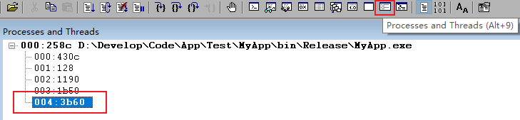

# 崩溃问题排查

## 排查过程

### 步骤1：配置符号文件

### 步骤2：打开崩溃时程序Dump文件

### 步骤3：执行分析

首先执行`!analyze -v`指令

> `!analyze`命令用于自动分析异常崩溃的原因。它会根据当前的调试上下文和符号信息，尝试诊断问题原因，并提供可能的解决方案。`-v`参数用于显示更详细的分析结果。

**输出示例**：

```
0:004> !analyze -v
*******************************************************************************
*                                                                             *
*                        Exception Analysis                                   *
*                                                                             *
*******************************************************************************

*** WARNING: Unable to verify checksum for MyApp.exe

KEY_VALUES_STRING: 1

    Key  : AV.Fault
    Value: Write

    Key  : Analysis.CPU.mSec
    Value: 1046

    Key  : Analysis.DebugAnalysisManager
    Value: Create

    Key  : Analysis.Elapsed.mSec
    Value: 3719

    Key  : Analysis.Init.CPU.mSec
    Value: 3046

    Key  : Analysis.Init.Elapsed.mSec
    Value: 20112

    Key  : Analysis.Memory.CommitPeak.Mb
    Value: 90

    Key  : Timeline.OS.Boot.DeltaSec
    Value: 1777131

    Key  : Timeline.Process.Start.DeltaSec
    Value: 59

    Key  : WER.OS.Branch
    Value: vb_release

    Key  : WER.OS.Timestamp
    Value: 2019-12-06T14:06:00Z

    Key  : WER.OS.Version
    Value: 10.0.19041.1


FILE_IN_CAB:  crash_full.dmp

NTGLOBALFLAG:  2000000

PROCESS_BAM_CURRENT_THROTTLED: 0

PROCESS_BAM_PREVIOUS_THROTTLED: 0

APPLICATION_VERIFIER_FLAGS:  0

APPLICATION_VERIFIER_LOADED: 1

CONTEXT:  (.ecxr)
rax=000001cd7862be70 rbx=0000008a869ffaf0 rcx=0000000000000000
rdx=0000000000000000 rsi=0000000000000000 rdi=0000000000000000
rip=00007ffb8021121c rsp=0000008a86fffba0 rbp=0000000000000000
r8=0000008a86fffaf8  r9=0000000000000000 r10=0000000000000000
r11=0000000000000246 r12=0000000000000000 r13=0000000000000000
r14=0000000000000000 r15=0000000000000000
iopl=0         nv up ei pl nz na pe nc
cs=0033  ss=002b  ds=002b  es=002b  fs=0053  gs=002b             efl=00010202
DLL1!ResourceManager::WorkerThreadProc+0x1c:
00007ffb`8021121c ff00            inc     dword ptr [rax] ds:000001cd`7862be70=????????
Resetting default scope

EXCEPTION_RECORD:  (.exr -1)
ExceptionAddress: 00007ffb8021121c (DLL1!ResourceManager::WorkerThreadProc+0x000000000000001c)
ExceptionCode: c0000005 (Access violation)
ExceptionFlags: 00000000
NumberParameters: 2
Parameter[0]: 0000000000000001
Parameter[1]: 000001cd7862be70
Attempt to write to address 000001cd7862be70

PROCESS_NAME:  MyApp.exe

WRITE_ADDRESS:  000001cd7862be70 

ERROR_CODE: (NTSTATUS) 0xc0000005 - 0x%p            0x%p                    %s

EXCEPTION_CODE_STR:  c0000005

EXCEPTION_PARAMETER1:  0000000000000001

EXCEPTION_PARAMETER2:  000001cd7862be70

STACK_TEXT:  
0000008a`86fffba0 00007ffb`84f97374     : 00000000`00000000 00000000`00000000 00000000`00000000 00000000`00000000 : DLL1!ResourceManager::WorkerThreadProc+0x1c
0000008a`86fffbd0 00007ffb`85fbcc91     : 00000000`00000000 00000000`00000000 00000000`00000000 00000000`00000000 : kernel32!BaseThreadInitThunk+0x14
0000008a`86fffc00 00000000`00000000     : 00000000`00000000 00000000`00000000 00000000`00000000 00000000`00000000 : ntdll!RtlUserThreadStart+0x21


STACK_COMMAND:  ~4s; .ecxr ; kb

SYMBOL_NAME:  DLL1!ResourceManager::WorkerThreadProc+1c

MODULE_NAME: DLL1

IMAGE_NAME:  DLL1.dll

FAILURE_BUCKET_ID:  INVALID_POINTER_WRITE_AVRF_c0000005_DLL1.dll!ResourceManager::WorkerThreadProc

OS_VERSION:  10.0.19041.1

BUILDLAB_STR:  vb_release

OSPLATFORM_TYPE:  x64

OSNAME:  Windows 10

FAILURE_ID_HASH:  {73400ff6-c07e-1f6c-67dc-ff84f9a8a5ad}

Followup:     MachineOwner
---------

```

`!analyze -v`指令一次输出的信息过多，可通过其他指令查看更具体的信息内容。

- `.exr`指令

    `.exr`指令（Display Exception Record）的核心作用是显示异常记录的详细信息。常用指令格式：`.exr -1`，用于显示最近发生的异常记录。
    ```
    0:004> .exr -1
    ExceptionAddress: 00007ffb8021121c (DLL1!ResourceManager::WorkerThreadProc+0x000000000000001c)
    ExceptionCode: c0000005 (Access violation)
    ExceptionFlags: 00000000
    NumberParameters: 2
    Parameter[0]: 0000000000000001
    Parameter[1]: 000001cd7862be70
    Attempt to write to address 000001cd7862be70
    ```

    通过`ExceptionCode`可知道发生的异常类型。
    
- `.ecxr`指令

    `.ecxr`指令的主要功能包括：
    - **显示异常上下文**：输出异常发生时的完整寄存器状态。
    - **切换上下文**：将调试器的当前线程上下文切换到异常发生的那个瞬间
    - **定位指令**：明确指出异常发生时正在执行的代码位置，一般仅针对崩溃模块为`Debug`模式编译得到，且需要配置源码路径。

    ```
    0:004> .ecxr
    rax=000001cd7862be70 rbx=0000008a869ffaf0 rcx=0000000000000000
    rdx=0000000000000000 rsi=0000000000000000 rdi=0000000000000000
    rip=00007ffb8021121c rsp=0000008a86fffba0 rbp=0000000000000000
    r8=0000008a86fffaf8  r9=0000000000000000 r10=0000000000000000
    r11=0000000000000246 r12=0000000000000000 r13=0000000000000000
    r14=0000000000000000 r15=0000000000000000
    iopl=0         nv up ei pl nz na pe nc
    cs=0033  ss=002b  ds=002b  es=002b  fs=0053  gs=002b             efl=00010202
    DLL1!ResourceManager::WorkerThreadProc+0x1c:
    00007ffb`8021121c ff00            inc     dword ptr [rax] ds:000001cd`7862be70=????????
    ```

- `kv`指令

    `kv`显示崩溃线程堆栈回溯详细信息。
    ```
     # Child-SP          RetAddr               : Args to Child                                                           : Call Site
    00 0000008a`86fffba0 00007ffb`84f97374     : 00000000`00000000 00000000`00000000 00000000`00000000 00000000`00000000 : DLL1!ResourceManager::WorkerThreadProc+0x1c
    01 0000008a`86fffbd0 00007ffb`85fbcc91     : 00000000`00000000 00000000`00000000 00000000`00000000 00000000`00000000 : kernel32!BaseThreadInitThunk+0x14
    02 0000008a`86fffc00 00000000`00000000     : 00000000`00000000 00000000`00000000 00000000`00000000 00000000`00000000 : ntdll!RtlUserThreadStart+0x21

    ```
    **注**：在大多数情况下，可以通过崩溃线程堆栈回溯信息确定异常发生时的调用链，但是某些异常可能破坏调用堆栈，如内存越界修改，所以不一定完全可信。

    - **堆栈信息可信的情况**

        - 源代码编译正确：编译器生成的调试信息（PDB文件）与代码匹配。

        - 内存未被破坏：程序在抛出异常时，堆栈内存结构完好。

        - 优化级别适中：调试版（Debug）或基本优化（/Od）的代码堆栈最可信。

        - 异常是程序主动抛出：如C++的throw、C#的throw、Windows的RaiseException。

    - **堆栈信息可能失真的情况**

        - 堆栈溢出（Stack Overflow）:堆栈被破坏，顶部帧可能正常，但往下全是乱码或重复的模式。表现为`kv`显示的函数调用链非常长，或者出现大量重复的相同地址。

        - 堆栈损坏（Stack Corruption）:缓冲区溢出、野指针覆盖了堆栈上的返回地址。表现为`kv`显示的函数调用链不连贯，返回地址指向了非代码区（如数据段、无效内存）。

### 步骤4：确定崩溃线程

打开**进程与线程**展示窗口，一般初次打开会高亮显示异常崩溃所在线程。



此处异常崩溃发生线程Id为`0x3b60`。
**注**：一般在确定异常崩溃线程Id后，可以进一步结合应用程序日志(要求日志打印含线程Id信息)分析崩溃场景。

### 步骤5：基于地址偏移量缩小崩溃问题排查范围(可选)

在对 Release 版应用程序崩溃问题排查时，可能得到如下类似崩溃堆栈信息：

```
 # Child-SP          RetAddr               : Args to Child                                                           : Call Site
00 00000041`1051ef50 00007ffd`6ac38112     : 00000000`00000002 00007ffd`6ac997f0 00000000`00000008 00000226`f3ef0000 : ntdll!RtlReportCriticalFailure+0x56
01 00000041`1051f040 00007ffd`6ac383fa     : 00000000`00000008 00000000`00000000 00000226`f3ef0000 00007ffd`6ab5b44d : ntdll!RtlpHeapHandleError+0x12
02 00000041`1051f070 00007ffd`6ac3e081     : 00000226`f3ef0000 00000226`f3ef0000 00000226`f3ef7340 00000000`00000000 : ntdll!RtlpHpHeapHandleError+0x7a
03 00000041`1051f0a0 00007ffd`6ab55bf0     : 00000226`f3ef0000 00000226`f3ef0000 00000226`f3ef7330 00000226`f3ef0000 : ntdll!RtlpLogHeapFailure+0x45
04 00000041`1051f0d0 00007ffd`6ab547b1     : 00000000`00000000 00000226`f3ef0000 00000000`00000000 00000000`00000000 : ntdll!RtlpFreeHeapInternal+0x4e0
05 00000041`1051f190 00007ffd`683ff05b     : 00000000`ffffffff 00000226`f3ef7340 00000000`00000000 00000000`00000000 : ntdll!RtlFreeHeap+0x51
06 00000041`1051f1d0 00007ffd`64ec17af     : 00000041`1051f2c0 00000000`00000000 00000000`0000e24a 00000000`00002733 : ucrtbase!free_base+0x1b
07 00000041`1051f200 00007ffd`64ec1605     : 00000000`00000000 00000000`0000e24a 00000041`1051f2c0 00000000`00000000 : XNetwork!XNetwork::XTcpClient::InnerConnect+0x8f
08 00000041`1051f230 00007ff6`e77015d6     : 00000226`f3ef96b0 00000000`00000000 00000000`00000000 00007ffd`51d84f40 : XNetwork!XNetwork::XTcpClient::Connect+0x95
09 00000041`1051f270 00007ff6`e7701653     : 00000226`f3ef96b0 00000226`f3ef96b0 00000000`00000000 00000000`000004a0 : Test!Test_XTcpClient::test_Connect+0x26
0a 00000041`1051f2a0 00007ff6`e7701b50     : 00000000`00000000 00000000`00000000 00000000`00000000 00000000`00000000 : Test!main+0x53
0b (Inline Function) --------`--------     : --------`-------- --------`-------- --------`-------- --------`-------- : Test!invoke_main+0x22 (Inline Function @ 00007ff6`e7701b50) [D:\a\_work\1\s\src\vctools\crt\vcstartup\src\startup\exe_common.inl @ 78] 
0c 00000041`1051fb40 00007ffd`68fe7374     : 00000000`00000000 00000000`00000000 00000000`00000000 00000000`00000000 : Test!__scrt_common_main_seh+0x10c [D:\a\_work\1\s\src\vctools\crt\vcstartup\src\startup\exe_common.inl @ 288] 
0d 00000041`1051fb80 00007ffd`6ab7cc91     : 00000000`00000000 00000000`00000000 00000000`00000000 00000000`00000000 : KERNEL32!BaseThreadInitThunk+0x14
0e 00000041`1051fbb0 00000000`00000000     : 00000000`00000000 00000000`00000000 00000000`00000000 00000000`00000000 : ntdll!RtlUserThreadStart+0x21

```

但可能无法直接定位到引起崩溃的源码位置。此时可通过地址偏移量来缩小崩溃问题排查范围。

1. 确定排查起点内存地址

    选择崩溃堆栈中较深层级的用户层函数代码基地址为排查起点地址。

    选择示例中栈帧`07`对应的`XNetwork!XNetwork::XTcpClient::InnerConnect`为排查起点地址。

1. 在排查起点地址处设置断点，并从断点处开始程序调试。

    设置断点指令：`bp XNetwork!XNetwork::XTcpClient::InnerConnect`

1. 不停`Step Over`，可在 WinDbg 中看到类似如下调试信息：

    ```
    Breakpoint 0 hit
    XNetwork!XNetwork::XTcpClient::InnerConnect:
    00007ffd`64ec1720 48895c2418      mov     qword ptr [rsp+18h],rbx ss:000000bb`c752f270=000002195a70dad0
    0:000> p
    XNetwork!XNetwork::XTcpClient::InnerConnect+0x5:
    00007ffd`64ec1725 48896c2420      mov     qword ptr [rsp+20h],rbp ss:000000bb`c752f278=0000000000000000
    0:000> p
    XNetwork!XNetwork::XTcpClient::InnerConnect+0xa:
    00007ffd`64ec172a 57              push    rdi
    0:000> p
    XNetwork!XNetwork::XTcpClient::InnerConnect+0xb:
    00007ffd`64ec172b 4883ec20        sub     rsp,20h
    0:000> p
    XNetwork!XNetwork::XTcpClient::InnerConnect+0xf:
    00007ffd`64ec172f 4533c9          xor     r9d,r9d
    0:000> p
    XNetwork!XNetwork::XTcpClient::InnerConnect+0x12:
    00007ffd`64ec1732 488bf9          mov     rdi,rcx
    0:000> p
    XNetwork!XNetwork::XTcpClient::InnerConnect+0x15:
    00007ffd`64ec1735 418d5101        lea     edx,[r9+1]
    0:000> p
    XNetwork!XNetwork::XTcpClient::InnerConnect+0x19:
    00007ffd`64ec1739 8d4a01          lea     ecx,[rdx+1]
    0:000> p
    XNetwork!XNetwork::XTcpClient::InnerConnect+0x1c:
    00007ffd`64ec173c 458d4106        lea     r8d,[r9+6]
    0:000> p
    XNetwork!XNetwork::XTcpClient::InnerConnect+0x20:
    00007ffd`64ec1740 e85bfbffff      call    XNetwork!XNetwork::_create_socket (00007ffd`64ec12a0)
    0:000> p
    *** WARNING: Unable to verify checksum for Test.exe
    XNetwork!XNetwork::XTcpClient::InnerConnect+0x25:
    00007ffd`64ec1745 33ed            xor     ebp,ebp
    0:000> p
    XNetwork!XNetwork::XTcpClient::InnerConnect+0x27:
    00007ffd`64ec1747 488907          mov     qword ptr [rdi],rax ds:000000bb`c752f2f0=ffffffffffffffff
    0:000> p
    XNetwork!XNetwork::XTcpClient::InnerConnect+0x2a:
    00007ffd`64ec174a 4883f8ff        cmp     rax,0FFFFFFFFFFFFFFFFh
    0:000> p
    XNetwork!XNetwork::XTcpClient::InnerConnect+0x2e:
    00007ffd`64ec174e 750a            jne     XNetwork!XNetwork::XTcpClient::InnerConnect+0x3a (00007ffd`64ec175a) [br=1]
    0:000> p
    XNetwork!XNetwork::XTcpClient::InnerConnect+0x3a:
    00007ffd`64ec175a 488b5710        mov     rdx,qword ptr [rdi+10h] ds:000000bb`c752f300=000002195a708f10
    0:000> p
    XNetwork!XNetwork::XTcpClient::InnerConnect+0x3e:
    00007ffd`64ec175e 41b810000000    mov     r8d,10h
    0:000> p
    XNetwork!XNetwork::XTcpClient::InnerConnect+0x44:
    00007ffd`64ec1764 488bc8          mov     rcx,rax
    0:000> p
    XNetwork!XNetwork::XTcpClient::InnerConnect+0x47:
    00007ffd`64ec1767 4889742438      mov     qword ptr [rsp+38h],rsi ss:000000bb`c752f268=00007ff6e7703351
    0:000> p
    XNetwork!XNetwork::XTcpClient::InnerConnect+0x4c:
    00007ffd`64ec176c 488b5208        mov     rdx,qword ptr [rdx+8] ds:00000219`5a708f18=000002195a703990
    0:000> p
    XNetwork!XNetwork::XTcpClient::InnerConnect+0x50:
    00007ffd`64ec1770 ff15e26a0000    call    qword ptr [XNetwork!_imp_connect (00007ffd`64ec8258)] ds:00007ffd`64ec8258={WS2_32!connect (00007ffd`699b1a50)}
    0:000> p
    XNetwork!XNetwork::XTcpClient::InnerConnect+0x56:
    00007ffd`64ec1776 b904000000      mov     ecx,4
    0:000> p
    XNetwork!XNetwork::XTcpClient::InnerConnect+0x5b:
    00007ffd`64ec177b 8bd8            mov     ebx,eax
    0:000> p
    XNetwork!XNetwork::XTcpClient::InnerConnect+0x5d:
    00007ffd`64ec177d e81a540000      call    XNetwork!operator new (00007ffd`64ec6b9c)
    0:000> p
    XNetwork!XNetwork::XTcpClient::InnerConnect+0x62:
    00007ffd`64ec1782 488bf0          mov     rsi,rax
    0:000> p
    XNetwork!XNetwork::XTcpClient::InnerConnect+0x65:
    00007ffd`64ec1785 4885c0          test    rax,rax
    0:000> p
    XNetwork!XNetwork::XTcpClient::InnerConnect+0x68:
    00007ffd`64ec1788 7408            je      XNetwork!XNetwork::XTcpClient::InnerConnect+0x72 (00007ffd`64ec1792) [br=0]
    0:000> p
    XNetwork!XNetwork::XTcpClient::InnerConnect+0x6a:
    00007ffd`64ec178a c7000a000000    mov     dword ptr [rax],0Ah ds:00000219`5a70a410=baadf00d
    0:000> p
    XNetwork!XNetwork::XTcpClient::InnerConnect+0x70:
    00007ffd`64ec1790 eb03            jmp     XNetwork!XNetwork::XTcpClient::InnerConnect+0x75 (00007ffd`64ec1795)
    0:000> p
    XNetwork!XNetwork::XTcpClient::InnerConnect+0x75:
    00007ffd`64ec1795 ba04000000      mov     edx,4
    0:000> p
    XNetwork!XNetwork::XTcpClient::InnerConnect+0x7a:
    00007ffd`64ec179a 488bce          mov     rcx,rsi
    0:000> p
    XNetwork!XNetwork::XTcpClient::InnerConnect+0x7d:
    00007ffd`64ec179d e836540000      call    XNetwork!operator delete (00007ffd`64ec6bd8)
    0:000> p
    XNetwork!XNetwork::XTcpClient::InnerConnect+0x82:
    00007ffd`64ec17a2 ba04000000      mov     edx,4
    0:000> p
    XNetwork!XNetwork::XTcpClient::InnerConnect+0x87:
    00007ffd`64ec17a7 488bce          mov     rcx,rsi
    0:000> p
    XNetwork!XNetwork::XTcpClient::InnerConnect+0x8a:
    00007ffd`64ec17aa e829540000      call    XNetwork!operator delete (00007ffd`64ec6bd8)
    0:000> p
    Critical error detected c0000374
    WARNING: This break is not a step/trace completion.
    The last command has been cleared to prevent
    accidental continuation of this unrelated event.
    Check the event, location and thread before resuming.
    (3df0.3a00): Break instruction exception - code 80000003 (first chance)
    ntdll!RtlReportCriticalFailure+0x56:
    00007ffd`6ac2f352 cc              int     3

    ```

1. 分析

    从输出的调试信息中，我们可以发现，在还未到达代码地址`XNetwork!XNetwork::XTcpClient::InnerConnect+0x8f`前，已经有过两次函数调用：`XNetwork!XNetwork::_create_socket`、`_imp_connect`，说明崩溃问题发生在上述两此次函数调用之后。所以在排查崩溃问题时，可以重点放在这两个函数调用之后的代码处。


**能够基于地址偏移量缩小崩溃问题排查范围的原理**：虽然每次启动进程，分配的代码内存地址并不固定，但是同一个函数内的代码地址偏移值是固定的。

## Q&A

**Q**：C/C++程序崩溃时最常见的几种异常代码

**A**：常见异常代码及含义如下

- **内存访问类**

    最常见的崩溃类型，通常与指针操作有关。

    - `0xC0000005`：Access Violation（访问违例）
        **含义**：程序试图访问一个它没有权限访问的内存区域。
        **典型场景**：
        - 对NULL（空指针）进行读写操作（解引用空指针）。
        - 使用已经释放的指针（野指针）。
        - 写入只读内存（例如修改字符串常量）。
        - 数组越界访问了受保护的内存区域。

    - `0xC0000094` / `0x80000002`：Integer Divide by Zero（整数除零）
        **含义**：程序执行了整数除以0的操作。
        **注意**：浮点数除以0通常不会触发这个异常，而是返回一个表示无穷大的特殊值（INF）。

    - `0xC0000008`：Invalid Handle（无效句柄）
        **含义**：程序向系统API传递了一个无效的句柄（例如文件句柄、事件句柄等）。
        **典型场景**：在关闭文件后继续尝试写入该文件句柄。

- **栈相关问题**

    - `0xC00000FD`：Stack Overflow（栈溢出）
        **含义**：程序的栈空间被耗尽了。
        **典型场景**：
        - 无限递归（函数无休止地调用自身）。
        - 在栈上分配了过大的局部变量（例如 char buffer[1024*1024*100]）。
        - 深层嵌套的函数调用。

- **堆/内存损坏类**

    - `0xC0000374`：Heap Corruption（堆损坏）
        **含义**：动态内存管理（malloc/new/free/delete）检测到堆结构被破坏。
        **典型场景**：
        - 释放内存后继续使用该内存。
        - 两次释放同一块内存（Double Free）。
        - 写入内存时超出分配的大小（堆缓冲区溢出）。
        - 在堆内存块的边界围栏（Cookie）被意外修改。

- **非法指令与对齐**

- `0xC000001D`：Illegal Instruction（非法指令）
    **含义**：CPU试图执行一条无效的指令。
    **典型场景**：
    - 函数指针损坏，指向了一个非代码区域。
    - 代码在仅支持旧指令集的CPU上运行，却尝试执行新指令集（如AVX指令）。
    - 跳转到数据或随机内存地址执行。

- `0xC0000096`：Non-continuable Exception（不可继续异常）
    **含义**：系统或代码试图继续执行一个不可恢复的异常。
    **典型场景**：在异常处理过程中发生了错误逻辑。

- **断言与C++标准异常**

    - `0x80000003`：Breakpoint / Assertion（断点或断言失败）
        **含义**：触发了断点指令。
        **典型场景**：
        - 在Debug版本的代码中，assert(condition) 失败。如果用户继续执行，往往会转为0xC000041D（栈缓冲区外泄）或直接终止。
        
        **注意**：在Release版本中，assert通常会被编译掉，所以这个异常多见于调试版本。   

    - `0xE06D7363`：Microsoft C++ Exception（C++ 异常）

        **含义**：这是由 throw 关键字抛出的标准C++异常（如 std::runtime_error、std::bad_alloc）。

        **解码**：0xE06D7363 中的 6D73 对应ASCII码的 'ms'，这其实是微软定义的C++异常标识。

        **注意**：如果你的程序没有用 try-catch 捕获这个异常，它就会导致程序崩溃。WinDbg需要配合 !cppexr 扩展命令来查看具体抛出的异常类型（如 std::out_of_range）。


**Q**：系统PDB文件缺失，对于异常分析的影响

**A**：在Windows平台上进行崩溃转储分析时，PDB 文件是连接机器码和可读源代码的关键桥梁。缺少系统 PDB 文件，尤其是关键模块（如 `ntdll.dll`、`kernel32.dll`）的符号，将直接导致调试器无法将地址转换为有意义的函数名，极大增加定位根本原因的难度。


