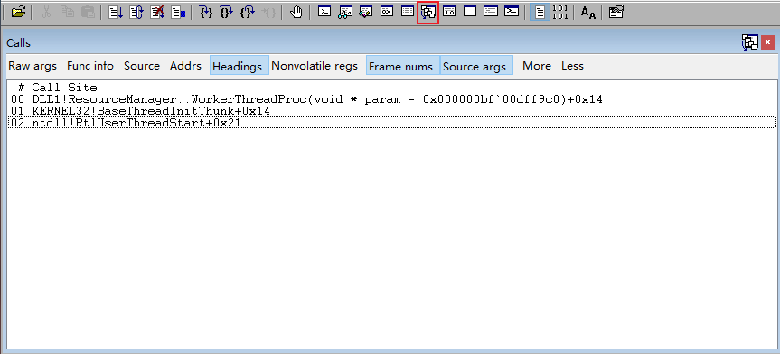
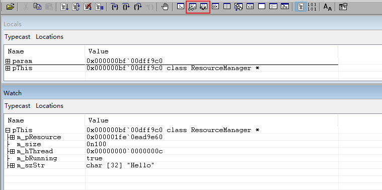
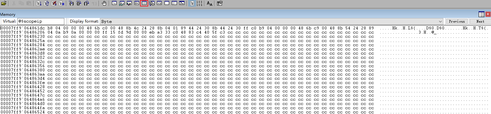
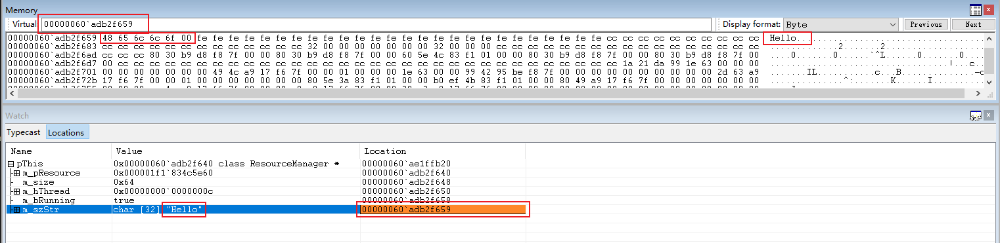

# 挂载调试

## 源码级调试

针对某个模块开展源码级调试，一般要求模块为`Debug`模式或降低优化等级后编译得到，保留尽量多的调试信息。

1. 配置源码路径(Source Path)

1. 挂载(`Open Executable...`或`Attach to a Process...`)

1. 设置断点

    - **方式1**：通过`bp`指令设置断点。
    - **方式2**：打开源码文件，通过光标定位代码行，使用快捷键`F9`设置断点。

1. 通过`g`命令恢复执行，直至命中断点

1. 执行步过(快捷键`F10`)、步入(快捷键`F11`)

**查看调用堆栈**

**变量监视**

带`0n`前缀的变量值表示以10进制显示。

在**Locals**或**Watch**窗口中，`int` 类型的变量默认就会显示为十进制值，而 `UINT` 等无符号整数则会遵循当前的基数设置(命令`n`可控制显示基数)。

**内存监视**

初次打开，Memory窗口的地址栏默认填充有`$scopeip`。`@$scopeip`是 WinDbg 中的一个内置伪寄存器，当它出现在 Memory 窗口的地址栏时，表示该窗口会动态跟随当前调试上下文中的指令指针。

**查看自定义地址内存**：

