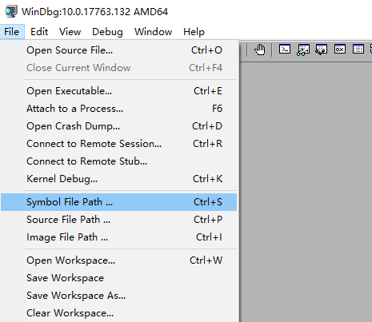
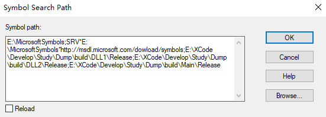
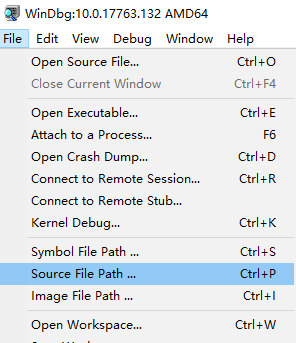
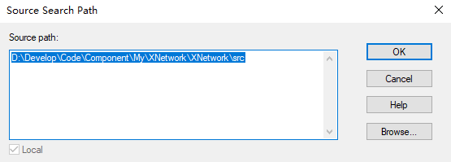

# 配置

## 配置符号路径(Symbol Path)

在**WinDbg**中配置符号路径的核心作用，是告诉调试器去哪里寻找符号文件（.pdb），从而将枯燥的二进制地址转换为有意义的函数名、变量和源代码信息，让你从“看汇编代码”升级为“看高级语言代码”进行调试。

**配置方法：**

|配置方式|语法格式|使用说明|典型应用场景|
|-|-|-|-|
|本地符号|C:\MyProject\Symbols|直接指定符号文件所在的本地文件夹路径。|如果你的.pdb文件就在本机，用这个最简单。调试自己刚刚在本机编译生成的程序。|
|符号服务器|srv*[本地缓存路径]*[服务器地址]|这是最推荐的配置方式。它告诉WinDbg先从本地缓存找，找不到则自动从指定的服务器下载。从微软符号服务器下载符号文件会存储至本地缓存路径，目录不存在时会自动创建。|调试系统进程或任何有公共符号的程序，如微软官方符号服务器。

- 每项路径配置间通过`;`分隔。

### Q&A

**Q：** 在某些情况下，如内网环境可能无法自动访问微软符号服务器获取PDB文件。

**A：** 通过**symchk**工具(一般与windbg在同一目录下)在合适环境获取PDB文件，再进行转移。

- 从微软符号服务器下载ntdll.dll对应pdb并存储在`E:\MicrosoftSymbols`目录下

    `symchk /r C:\Windows\System32\ntdll.dll /s SRV*E:\MicrosoftSymbols*[http://msdl.microsoft.com/download/symbols](http://msdl.microsoft.com/download/symbols)`

- 从微软符号服务器下载指定目录下所有dll对应的pdb并存储在`E:\MicrosoftSymbols`目录下

    `symchk /r C:\Windows\System32 /s SRV*E:\MicrosoftSymbols*[http://msdl.microsoft.com/download/symbols](http://msdl.microsoft.com/download/symbols)`

## 配置源码路径(Source Path)

在WinDbg中配置源码路径的作用，简单来说就是告诉调试器去哪里找到与正在调试的二进制文件相对应的源代码文件，从而实现**源代码级别**的调试。

源码路径的配置方式与符号路径类似。

- 每项路径配置间通过`;`分隔。

### Q&A

**Q：** 源码查找的逻辑

**A：** 当你在WinDbg中调试时，它是这样查找源码文件的：

1. 从符号文件中获取原始路径：`.pdb`文件中会记录编译时源码文件的绝对路径（例如D:\BuildServer\workspace\project\main.cpp）

1. 路径映射：如果当前机器上不存在这个绝对路径，WinDbg会尝试使用源码路径进行路径替换

1. 搜索源码路径：在配置的源码路径列表中查找文件名匹配的源码文件

1. 提示手动查找：如果找不到，WinDbg会弹出对话框让你手动定位源码文件

**Q：** 源码路径配置层级

**A：** WinDbg 在查找源码时非常灵活，它并不要求你设置的源码路径必须和编译时记录的路径分毫不差。关键在于它使用了一种 “路径映射/部分匹配” 的机制。你可以把它理解为一个智能的搜索过程：

- **编译时记录的“绝对路径”**：.pdb 符号文件中，存储的是源文件在编译机器上的完整路径（例如 D:\BuildServer\MyProject\main.cpp）。这个路径在你的机器上很可能不存在。

- **WinDbg 的“智能搜索”**：当你配置了源码路径（如 C:\MyLocalCode）后，WinDbg 会在这个路径下，尝试根据文件名进行部分匹配来定位文件。它不会拿着 D:\BuildServer\MyProject\main.cpp 这个完整路径去你的硬盘上找，而是会拿着文件名 main.cpp，在你指定的 C:\MyLocalCode 目录及其子目录中搜索。

