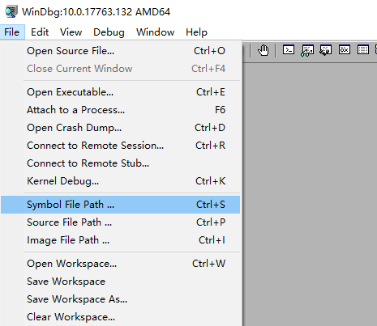
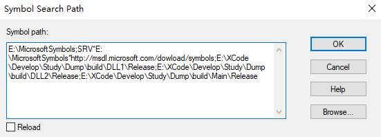
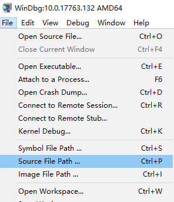
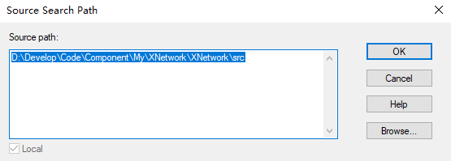

# 配置

## 配置符号路径(Symbol Path)

在**WinDbg**中配置符号路径的核心作用，是告诉调试器去哪里寻找符号文件（.pdb），从而将枯燥的二进制地址转换为有意义的函数名、变量和源代码信息，让你从“看汇编代码”升级为“看高级语言代码”进行调试。





**配置方法**

|配置方式|语法格式|使用说明|典型应用场景|
|-|-|-|-|
|私有符号|`C:\MyProject\Symbols`|直接指定符号文件所在的本地文件夹路径。|如果你的.pdb文件就在本机，用这个最简单。调试自己刚刚在本机编译生成的程序。|
|符号服务器|`srv*[本地缓存路径]*[符号服务器地址]`|这是最推荐的配置方式。它告诉WinDbg先从本地缓存路径找，找不到则自动从指定的服务器下载。从微软符号服务器下载符号文件会存储至本地缓存路径，目录不存在时会自动创建。|调试系统进程或任何有公共符号的程序，如微软官方符号服务器。|

- **符号查找路径配置格式**：由`;`分隔的多个目录组成，例如：`D:\MyProject\Symbols;srv*D:\MicrosoftSymbols*http://msdl.microsoft.com/download/symbols`

**符号文件查找逻辑**

WinDbg 查找符号的核心机制是精确匹配，而不是简单的文件名匹配。每个PDB符号文件在编译生成时，都会包含一个与对应二进制文件完全相同的唯一标识符（**GUID和Age**）。

WinDbg 在查找私有PDB符号文件时，不会递归遍历指定符号查找目录下的所有子目录。只会精确地在以下几类位置进行查找，假设配置的私有符号查找路径为`D:\MyProject\`，WinDbg 会依次检查以下三类目录：

对于dll二进制文件类型：
- `D:\MyProject\symbols\dll`
- `D:\MyProject\dll`
- `D:\MyProject`

对于exe二进制文件类型：
- `D:\MyProject\symbols\exe`
- `D:\MyProject\exe`
- `D:\MyProject`

**注意事项**

- **精确匹配**：WinDbg只加载与当前调试的二进制文件完全匹配的符号文件。

- **应用新路径**：修改了符号路径后，必须执行`.reload`命令，WinDbg才会使用新路径去重新加载所有模块的符号 。

- **排除故障**：如果符号加载有问题，可以使用`!sym noisy`命令开启详细输出模式，WinDbg会打印出它在每个路径下查找符号的详细信息，这对于定位问题非常有帮助。


## 配置源码路径(Source Path)

在WinDbg中配置源码路径的作用，简单来说就是告诉调试器去哪里找到与正在调试的二进制文件相对应的源代码文件，从而实现**源代码级别**的调试。

源码路径的配置方式与符号路径类似。





- 每项路径配置间通过`;`分隔。

## Q&A

**Q**：GUID (全局唯一标识符)

**A**：GUID 是一个 128 位（16 字节）的全局唯一标识符。在 Windows 的 PE 文件（.exe, .dll）和其对应的 PDB 文件中，它扮演着“编译事件指纹”的角色。当链接器（link.exe）对代码进行链接，生成最终的二进制文件（.dll）和符号文件（.pdb）时，链接器会基于以下几个关键信息，通过特定算法生成一个唯一的 GUID：

- 源代码文件的时间戳和哈希值
- 编译时的具体时间
- 编译选项和配置（例如，是 Debug 还是 Release 模式，是否进行了优化等）
- 并不是每次编译会重新生成GUID

---

**Q**：Age

**A**：Age 是一个 32 位的整数（可以理解为一个从 0 开始递增的计数器），存储在 PDB 文件中，并且也被嵌入到对应的二进制文件（.exe/.dll）中。Age 的主要作用是处理链接器的增量链接（Incremental Linking）功能。

- **增量链接**：这是一种为了加快开发编译速度而设计的链接方式。当你修改了一小部分代码后重新编译，链接器不必重新链接所有目标文件（.obj），而是只更新发生变化的部分，并修补现有可执行文件的结构。这个过程会多次用到同一个 PDB 文件。**增量链接是同一次"编译会话"中的行为，因此会保留最初的GUID不变**。

- **Age 的递增**：每次发生增量链接时，PDB 文件的内容会被更新，但其 GUID 保持不变（因为它代表的是这次“编译会话”）。为了记录这个 PDB 文件已经被修改了多少次，Age 计数器就会增加 1。

---

**Q**：在某些情况下，如内网环境可能无法自动访问微软符号服务器获取PDB文件。

**A**：通过**symchk**工具(一般与windbg在同一目录下)在合适环境获取PDB文件，再进行转移。

- 从微软符号服务器下载ntdll.dll对应pdb并存储在`E:\MicrosoftSymbols`目录下

    `symchk /r C:\Windows\System32\ntdll.dll /s SRV*E:\MicrosoftSymbols*[http://msdl.microsoft.com/download/symbols](http://msdl.microsoft.com/download/symbols)`

- 从微软符号服务器下载指定目录下所有dll对应的pdb并存储在`E:\MicrosoftSymbols`目录下

    `symchk /r C:\Windows\System32 /s SRV*E:\MicrosoftSymbols*[http://msdl.microsoft.com/download/symbols](http://msdl.microsoft.com/download/symbols)`

---

**Q：** 源码查找的逻辑

**A：** 当你在WinDbg中调试时，它是这样查找源码文件的：

1. 从符号文件中获取原始路径：`.pdb`文件中会记录编译时源码文件的绝对路径（例如D:\BuildServer\workspace\project\main.cpp）

1. 路径映射：如果当前机器上不存在这个绝对路径，WinDbg会尝试使用源码路径进行路径替换

1. 搜索源码路径：在配置的源码路径列表中查找文件名匹配的源码文件

1. 提示手动查找：如果找不到，WinDbg会弹出对话框让你手动定位源码文件

**Q：** 源码路径配置层级

**A：** WinDbg 在查找源码时非常灵活，它并不要求你设置的源码路径必须和编译时记录的路径分毫不差。关键在于它使用了一种 “路径映射/部分匹配” 的机制。你可以把它理解为一个智能的搜索过程：

- **编译时记录的“绝对路径”**：.pdb 符号文件中，存储的是源文件在编译机器上的完整路径（例如 D:\BuildServer\MyProject\main.cpp）。这个路径在你的机器上很可能不存在。

- **WinDbg 的“智能搜索”**：当你配置了源码路径（如 C:\MyLocalCode）后，WinDbg 会在这个路径下，尝试根据文件名进行部分匹配来定位文件。它不会拿着 D:\BuildServer\MyProject\main.cpp 这个完整路径去你的硬盘上找，而是会拿着文件名 main.cpp，在你指定的 C:\MyLocalCode 目录及其子目录中搜索。

--- 

**Q：** 如何查看二进制文件GUID和Age

**A：** 通过MSVC编译配套工具dumpbin，命令格式：`dumpbin /headers "<二进制文件路径>" | findstr /i "pdb"`

- `/headers`：显示DLL文件的PE头结构信息

- `|`：管道符，将dumpbin的输出传递给findstr

- `findstr /i "pdb"`：在输出中查找包含"pdb"的行（`/i`表示不区分大小写）

> dumpbin 是 Microsoft Visual Studio 自带的一个强大的命令行工具，专门用于分析 Windows 下的二进制文件，比如 .exe 可执行文件、.dll 动态链接库、.lib 静态库和 .obj 目标文件。你可以把它想象成一个“二进制文件显微镜”，能让你深入查看这些文件的结构和内容。

示例：
```
dumpbin /headers "D:\Develop\Code\App\Test\DLL1\bin\Release\DLL1.dll" | findstr /i "pdb"
    69A3C1C8 cv            4D 00003738     2938    Format: RSDS, {196C72A9-68A3-4094-B00F-CA4D3BF4AABA}, 1, D:\Develop\Code\App\Test\build\DLL1\Release\DLL1.pdb
```

- `{196C72A9-...}`：PDB文件的唯一GUID标识符，用于匹配EXE/DLL和PDB
- `1`：Age，PDB文件的版本号
- `D:\Develop...\DLL1.pdb`：编译时生成的PDB文件的完整路径

---

**Q：** 如何判断二进制文件与PDB文件是否匹配

**A：** 通过symchk工具，命令格式：`symchk /v <二进制文件路径> /s <符号文件查找目录路径>`

- `/v`：输出详细信息。

- `/s`：指定符号文件查找目录路径。

> symchk 是Windows调试工具包中一个强大的命令行工具，它的核心功能是检查和验证符号文件（.pdb）是否与对应的可执行文件（如.exe、.dll）匹配，并能够从符号服务器下载所需符号文件。

示例：
```
symchk /v D:\Develop\Code\App\Test\MyApp\bin\Release\MyApp.exe /s C:\Users\Admin\Desktop\Tmp
[SYMCHK] Searching for symbols to D:\Develop\Code\App\Test\MyApp\bin\Release\MyApp.exe in path C:\Users\Admin\Desktop\Tmp
DBGHELP: Symbol Search Path: C:\Users\Admin\Desktop\Tmp
[SYMCHK] Using search path "C:\Users\Admin\Desktop\Tmp"
DBGHELP: No header for D:\Develop\Code\App\Test\MyApp\bin\Release\MyApp.exe.  Searching for image on disk
DBGHELP: D:\Develop\Code\App\Test\MyApp\bin\Release\MyApp.exe - OK
DBGHELP: MyApp - private symbols & lines
        C:\Users\Admin\Desktop\Tmp\MyApp.pdb
[SYMCHK] MODULE64 Info ----------------------
[SYMCHK] Struct size: 1680 bytes
[SYMCHK] Base: 0x140000000
[SYMCHK] Image size: 36864 bytes
[SYMCHK] Date: 0x68d75333
[SYMCHK] Checksum: 0x00000000
[SYMCHK] NumSyms: 0
[SYMCHK] SymType: SymPDB
[SYMCHK] ModName: MyApp
[SYMCHK] ImageName: D:\Develop\Code\App\Test\MyApp\bin\Release\MyApp.exe
[SYMCHK] LoadedImage: D:\Develop\Code\App\Test\MyApp\bin\Release\MyApp.exe
[SYMCHK] PDB: "C:\Users\Admin\Desktop\Tmp\MyApp.pdb"
[SYMCHK] CV: RSDS
[SYMCHK] CV DWORD: 0x53445352
[SYMCHK] CV Data:  D:\Develop\Code\App\Test\build\MyApp\Release\MyApp.pdb
[SYMCHK] PDB Sig:  0
[SYMCHK] PDB7 Sig: {08F9D2BB-C18D-4C1D-9EFF-C6308219D727}
[SYMCHK] Age: 11
[SYMCHK] PDB Matched:  TRUE
[SYMCHK] DBG Matched:  TRUE
[SYMCHK] Line numbers: TRUE
[SYMCHK] Global syms:  TRUE
[SYMCHK] Type Info:    TRUE
[SYMCHK] ------------------------------------
SymbolCheckVersion  0x00000002
Result              0x001f0001
DbgFilename
DbgTimeDateStamp    0x68d75333
DbgSizeOfImage      0x00009000
DbgChecksum         0x00000000
PdbFilename         C:\Users\Admin\Desktop\Tmp\MyApp.pdb
PdbSignature        {08F9D2BB-C18D-4C1D-9EFF-C6308219D727}
PdbDbiAge           0x00000011
[SYMCHK] [ 0x00000000 - 0x001f0001 ] Checked "D:\Develop\Code\App\Test\MyApp\bin\Release\MyApp.exe"

SYMCHK: FAILED files = 0
SYMCHK: PASSED + IGNORED files = 1
```

**PDB文件匹配验证（核心）**:

```
[SYMCHK] CV: RSDS                      (PDB签名格式)
[SYMCHK] CV Data:  D:\Develop\Code\App\Test\build\MyApp\Release\MyApp.pdb (编译时记录的PDB路径)
[SYMCHK] PDB Sig:  0
[SYMCHK] PDB7 Sig: {08F9D2BB-C18D-4C1D-9EFF-C6308219D727} (PDB文件的GUID)
[SYMCHK] Age: 11                       (PDB版本号)
[SYMCHK] PDB Matched:  TRUE             (✅ PDB文件匹配成功)
[SYMCHK] DBG Matched:  TRUE             (✅ DBG文件匹配成功)
[SYMCHK] Line numbers: TRUE             (包含行号信息)
[SYMCHK] Global syms:  TRUE             (包含全局符号)
[SYMCHK] Type Info:    TRUE             (包含类型信息)
```

