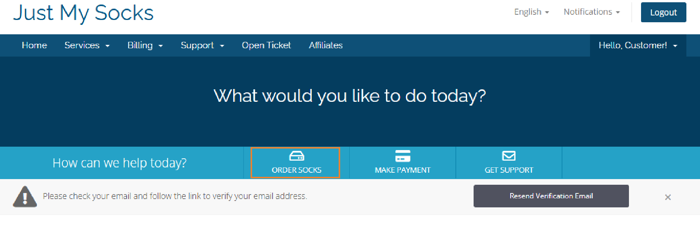
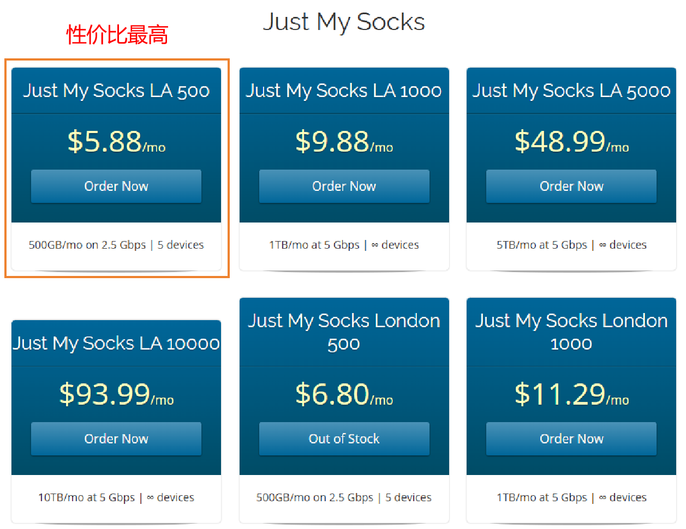
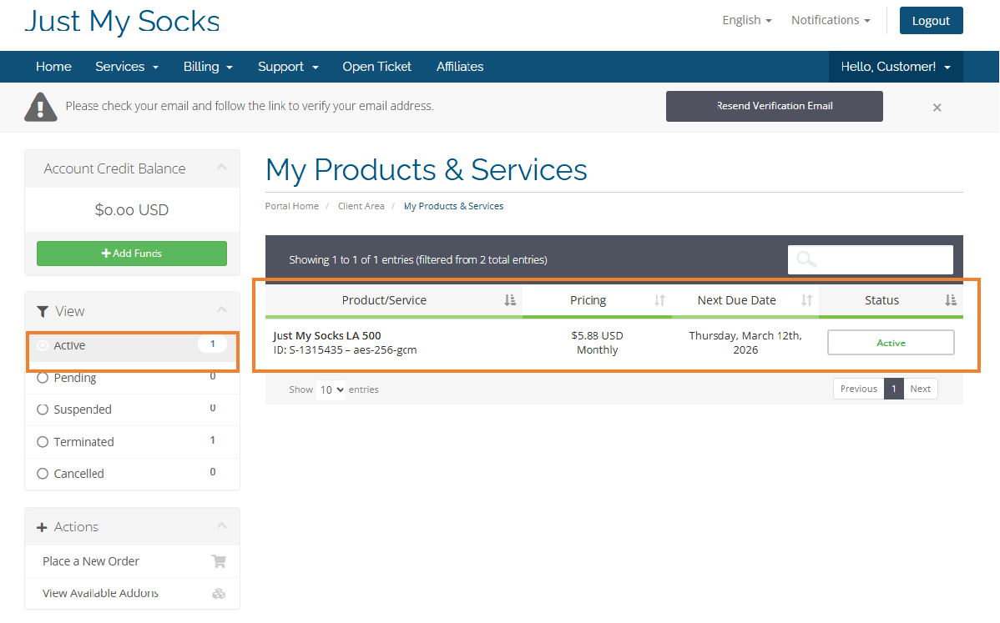
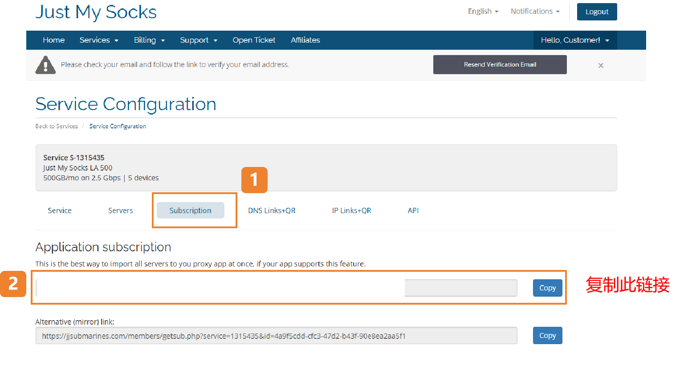
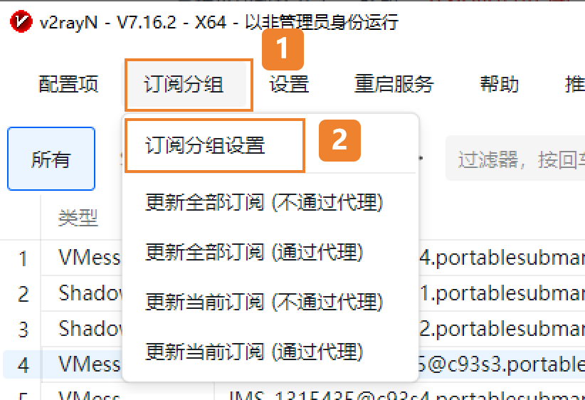
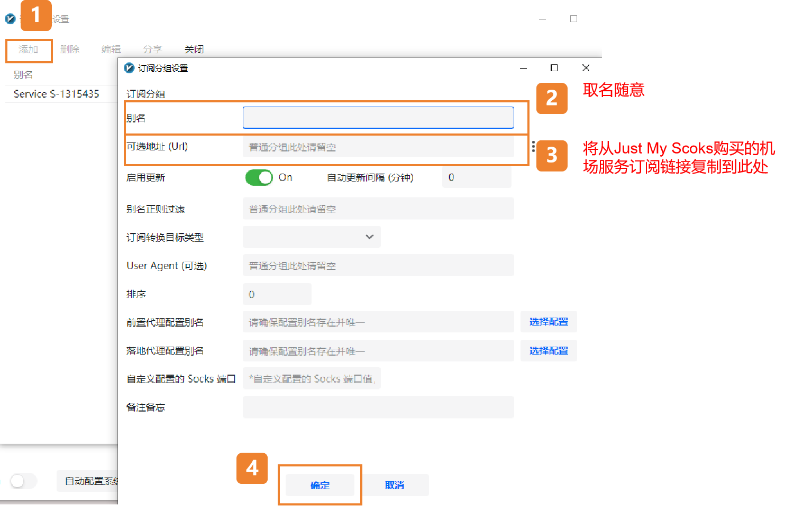
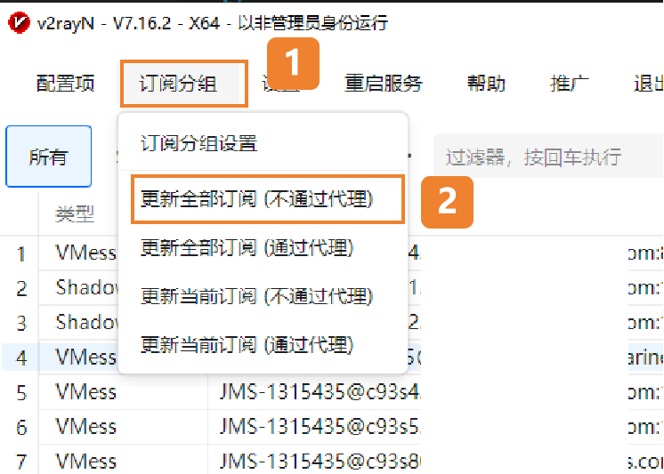
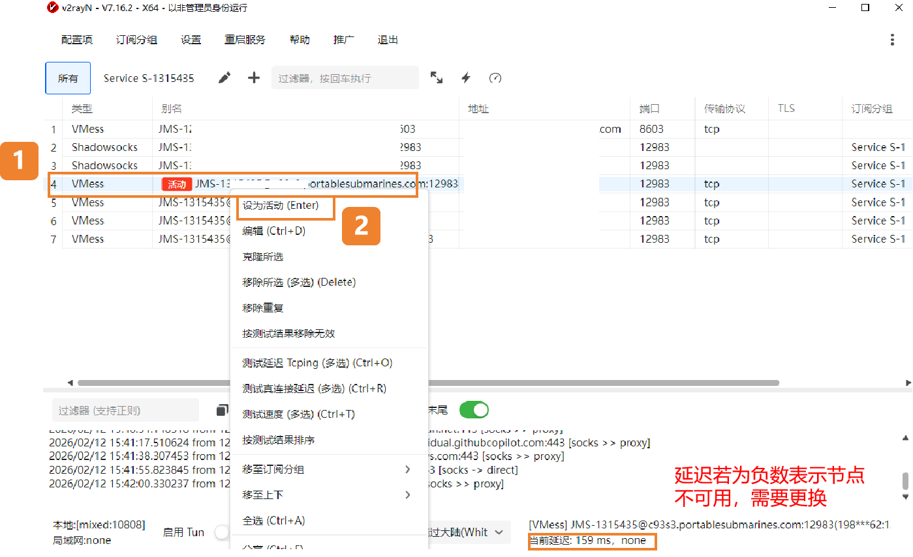
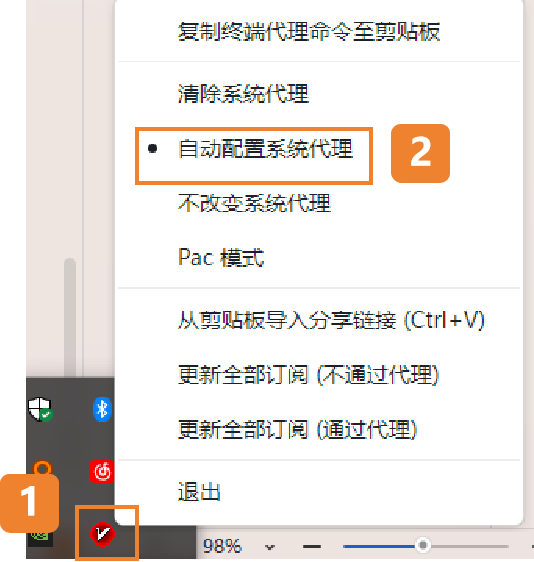

# 科学上网方法

## 简介

通过 [Just My Socks](https://justmysocks3.net/members/index.php)+[v2rayN](https://v2rayn.la/)工具实现科学**付费**上网。

!!!Note
    **Just My Socks**（JMS）是一家提供付费 SOCKS5/VPN 中转服务的服务商，常用于购买海外带宽节点以实现翻墙/科学上网。提供稳定的带宽、多个国家/地区的节点选项、支持 SOCKS5 代理、通常可与第三方客户端（如 v2rayN、Shadowsocks 客户端）配合使用来实现流量转发。

!!!Note
    **v2rayN**（JMS）是 Windows 平台上的 V2Ray 客户端图形界面（GUI），用于管理和运行 V2Ray 协议的代理连接。支持多协议（VMess、VLESS、Shadowsocks 等）、多节点管理、一键切换、订阅导入、路由规则、分应用代理和本地 DNS 转发。

## 步骤1：购买机场服务

- 进入购买服务

- 选择服务

- 查看已购买的服务激活状态

## 步骤2：v2rayN关联机场服务

- 复制订阅链接

- 进入订阅分组设置

一些代理机场往往会提供一个订阅地址，就可以使用订阅方式导入节点信息。

- 添加订阅

输入别名，在可选地址(Url)部分粘贴订阅地址。

- 更新订阅

添加完成后，点击软件主界面的订阅分组，然后点击更新全部订阅(不通过代理)即可成功使用订阅地址添加节点信息。

- 选择节点

在软件主界面选择任意节点，单击鼠标右键，在弹出的窗口中扎到设为活动服务器即可选择节点，如下图所示，然后开启系统代理即可，也可以选择任意节点，双击鼠标左键选择节点。

## 步骤4：开启系统代理

按照上面的配置教程配置完服务器（节点）后，需要设置系统代理才能让浏览器支持科学上网功能，在任务栏右下角系统托盘找到软件的图标，在图标上单击鼠标右键，点击自动配置系统代理，此时软件的图标会标称红色，至此就可以开始科学上网啦！

